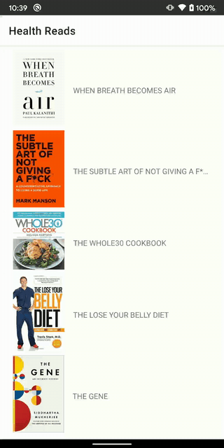

# Health Reads

Simple app that lets you browse Health books available via NYTimes API.

## Running the sample
Define `NYT_API_KEY` in ~/.gradle/gradle.properties or in your project root in order to run the app. You can get your own API key [here](https://developer.nytimes.com/apis).

## Comments
* Current implementation does not paginate results. If I was making a production version, I'd probably go with Jetpack Paging library with BoundaryCallbacks.
* I am using Retrofit and its `suspend` implementation already uses `Dispatchers.IO` under the hood. Therefore, I am not explicitly switching to background thread anywhere in the app. I would do that if there was a resource-intensive operation or some additional network calls outside of Retrofit.
* I want my remote endpoint to be the single source of truth and therefore look up a list of books first for the list screen and then again for the detail screen. However, the NYTimes API for looking up books is rather limiting (one cannot look up an additional book detail aside from book review). 
So I select all books again and filter the list for the ISBN I need. In a production app, I would go for a more offline support implementation and store data and display data locally until user explicitly pulls to refresh.
* Because the app heavily relies on HTTP requests, I added HTTP caching with 10 min TTL. In case of a cache hit, the loading time is under 10 ms (as opposed to 500+ ms without caching or in case of a cache miss). Besides faster loading, this helps save user battery, lets them use the app offline much of the time, and helps prevent HTTP access errors when many API requests are made in quick succession.  
* Originally, both `ViewModel`s in the app used `MutableStateFlow` for the view to observe. I ran into some issues unit-testing this implementation, so I made one `ViewModel` being unit-tested use `LiveData` in the meantime.
* I tried handling process death for the `BookDetailViewModel` but ran into issues getting it to work despite the fact that Koin is supposed to support `SavedStateHandle` in `ViewModel`s now.
* The return type of `BookRepository#fetchBook(isbn: String)` could be `Result<Book>` but kotlin `Result` is not supported in function return types yet so I wrapped it in `Flow` (even thought it's effectively a one-shot operation, not a stream).
